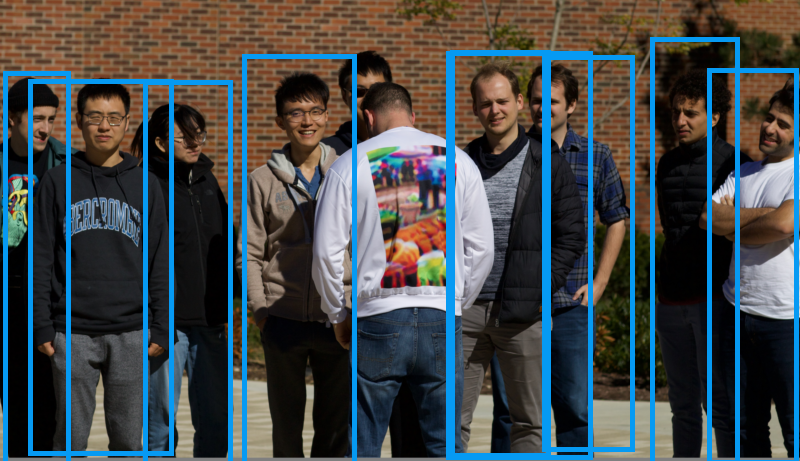
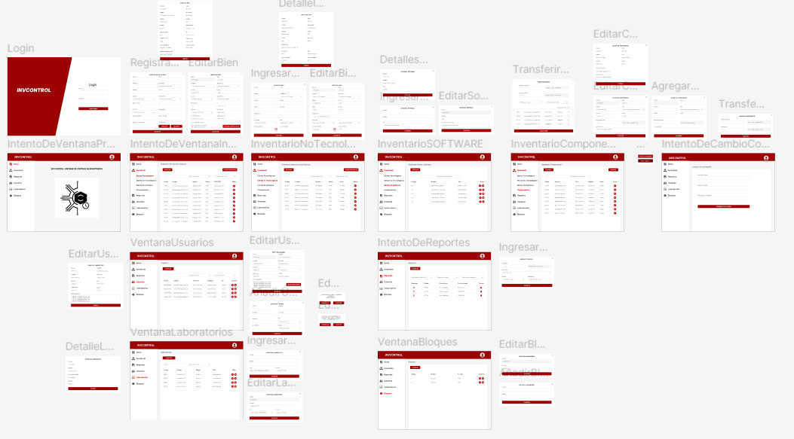

<h1 align="center">Hello, I'm <a href="https://profiledarkangel.netlify.app/" style="    background: linear-gradient(270deg, #8e2de2 10%, #00c6ff 100%);
    background-clip: text;
    -webkit-background-clip: text;
    -webkit-text-fill-color: transparent;">Angel Pilamunga</a> 👋 </h1>

  

## About Me

Full Stack Developer | Software Engineering Student
Hi I'm Angel, passionate about creating dynamic interfaces and robust backend systems, with experience in scalable and innovative applications. I specialize in modern technologies and best practices, collaborating with teams to deliver secure and effective solutions. Final-year Software Engineering student with a growing interest in cybersecurity and Linux-based networks. Driven to contribute to organizational success through expertise in Full Stack development and continuous learning.

## :alien: Follow me

    

   

##  <b> Skills</b> :eyeglasses:

### Languages:

   
### Database:

   
### Backend:

### Frontend:

   
### Tools:

 

## Proyects
<table>
<tr>
<td width="50%">
<h3 align="center">CNN Clothing Color Recognition</h3>

Development of a convolutional neural network to train it to recognize people and the main clothes they were wearing, identifying the colors of the tops and bottoms. Libraries were used that facilitated the development of the project. This program includes an interface for detecting the color of clothing in real time using the device's camera.

                                                                                      
</td>

<td width="50%">
                
<h3 align="center">
InvControl</h3>

                                       

 

Development of an inventory management system for the control of non-current assets of the Faculty of Systems, Electronic and Industrial Engineering of the Technical University of Ambato. This project included recording categories, locations and assets, asset disposal and control, and detailed reporting.

                                                             
</table>                                                                                 

 

<table>
<tr>
<td width="50%">
<h3 align="center">Document Process Map</h3>

Due to institutional security policies, no further information can be provided.

Development support of a web application for the company “Mushuc Runa Ltda.” to control document management and access restrictions in the different departments.

                                                                                      
</td>       

</table>                                                                                 

 

### ⚙️ &nbsp;GitHub Analytics

