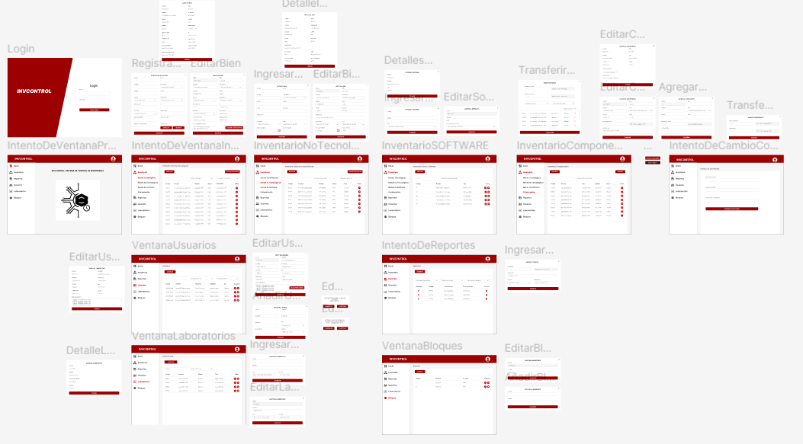
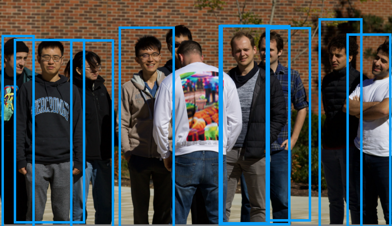

 

## About Me

**Full-Stack Software Developer | Ambato, Ecuador**

I build end-to-end web applications across frontend and backend, with hands-on experience in deployment and production delivery. Over the past year I have redesigned RESTful APIs, shipped full-stack features, and led work in Scrum teams focused on clean architecture and reliable releases.

📧 [angelpilamunga2098@gmail.com](mailto:angelpilamunga2098@gmail.com) · 📞 +593 962 984 732 · [LinkedIn](https://www.linkedin.com/in/angel-pilamunga-30a758133/) · [GitHub](https://github.com/DemoAnge)

## :alien: Follow me

    
    

## <b> Skills</b> :eyeglasses:

### Languages:

   
### Frontend:

### Backend:

   
### Database:

   
### Tools:

## Projects
<table>
<tr>
<td width="50%">
<h3 align="center">ERP Florícola</h3>

<em>May 2026 – Present · Private</em>

Full-stack ERP for a floriculture business: financial modules plus sales and purchases. Built with Angular, C#, PostgreSQL and RESTful APIs under Scrum. Code and screenshots are private by client policy.

</td>
<td width="50%">
 
<h3 align="center">Sistema de Inventario de Activos (InvControl)</h3>

 

<em>Ene – May 2026</em>

Asset inventory system for the Faculty of Systems, Electronic and Industrial Engineering (UTA). React, Django, MySQL, Tailwind and RESTful APIs with Python — real-time search, role-based access, categories/locations, disposal control and reporting.

</td>
</tr>
</table>
 

<table>
<tr>
<td width="50%">
<h3 align="center">CNN Clothing Color Recognition</h3>

Development of a convolutional neural network to train it to recognize people and the main clothes they were wearing, identifying the colors of the tops and bottoms. Libraries were used that facilitated the development of the project. This program includes an interface for detecting the color of clothing in real time using the device's camera.

</td>
<td width="50%">
 
<h3 align="center">Document Process Map</h3>

Due to institutional security policies, no further information can be provided.

Development support of a web application for the company “Mushuc Runa Ltda.” to control document management and access restrictions in the different departments.

</td>
</tr>
</table>
 

<table>
<tr>
<td width="50%">
<h3 align="center">RAEE Research</h3>

<em>Research · Academic</em>

Research work on Waste Electrical and Electronic Equipment (RAEE / WEEE): analysis, documentation and applied study aligned with academic and environmental goals. Publication details available on request.

</td>
</tr>
</table>
 

### ⬇️ &nbsp;GitHub Analytics

